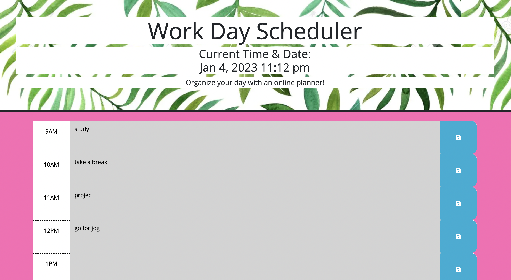

# Simple Calendar Application

The goal of this homework was to create a daily planner where you can save your daily activities. 

## Link and Screenshot

[Link](https://dltorrise.github.io/Simple-Calendar-App/)

Screenshot:

## Acknowledgements

I received inspiration for local storage functions from my classmate Adam. 

[His Github](https://github.com/Variegatedhuman)

The photo in the background header was created by [catarchangel](https://www.123rf.com/profile_catarchangel)
